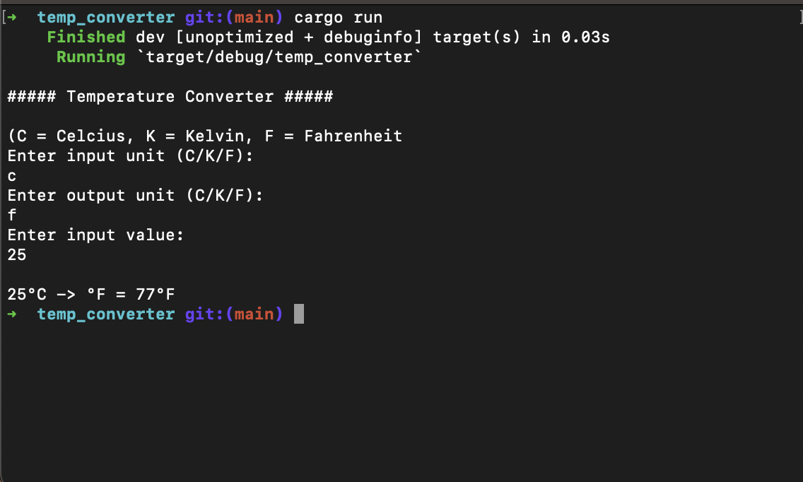

A simple temperature converter CLI app written in Rust. It converts between Celcius, Fahrenheit and Kelvin temperature scales.

A [GUI version](https://github.com/faetysal/temperature_converter_gui) of the app also exists, using the same code with Flutter as the UI Framework.
